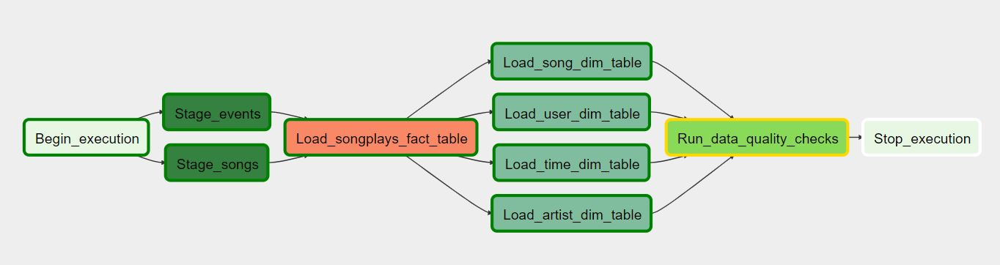

# Project: Data Pipelines with Airflow

## Introduction

This time our music streaming company, Sparkify, has decided that it is time to introduce more automation and monitoring to their data warehouse ETL pipelines by using [Apache Airflow](https://airflow.apache.org/).

The source data resides in Amazon S3 buckets and needs to be processed into Sparkify's data warehouse in Amazon Redshift (remember project 4).

After setting up an AWS Redshift DB, the task is building an ETL pipeline that:

- extracts the JSON data from S3
- processed them, and
- loads them back to S3 as a set of dimensional analytics tables.

The data pipeline has to be dynamic, built from reusable tasks, enables monitoring, allows easy backfills, and conducts automated data quality checks. The pipline steps / tasks are visualized as follows:

## Input data

Data is collected for song metadata and user activities, using JSON files. The data comes in the same structure as in projects 1 and 4, but now resides in AWS S3. Here are the S3 links for each:

- Song data: `s3://udacity-dend/song_data`
- Log data: `s3://udacity-dend/log_data`

Log data json path: `s3://udacity-dend/log_json_path.json`

### Song dataset format

These files are partitioned by the first three letters of each song's track ID. For example, here are filepaths to two files in this dataset:

- `song_data/A/B/C/TRABCEI128F424C983.json`
- `song_data/A/A/B/TRAABJL12903CDCF1A.json`

(See README of project 1 for details on the structure of a single entry.)

### Log dataset format

The log files in the dataset you'll be working with are partitioned by year and month. For example, here are filepaths to two files in this dataset.

`log_data/2018/11/2018-11-12-events.json`
`log_data/2018/11/2018-11-13-events.json`

(See README of project 1 for details on the structure of a single entry.)

## Target Schema

Final fact and dimension tables follow the same star schema as in projects 1 and 4. It is defined as follows:

## Build

Python 3.6. or higher - Used to code DAG's and its dependecies
Apache Airflow 1.10.2 - Workflows platform

## Config

AWS credentials and Redshift connection are managed directly in Airflow's UI.

## Run

Prerequisites: Access to AWS and an Amazon Redshift cluster.

1. Set up a Redshift database and create the necessary tables.
2. Put project files in their respective folders in an Airflow installation.
3. Adjust parameters in the DAG script, spakify_dag.py, as desired.
4. Set aws_credentials and redshift connection in Airflow.
5. Launch sparkify_dag from the Airflow UI.

## Scripts in Repo

- `create_tables.sql` - Contains DDL for all tables (provided)
- `sparkify_dag.py` - The DAG configuration file to run in Airflow
- `stage_redshift.py` - Custom operator to read files from S3 and load into Redshift staging tables
- `load_fact.py` - Custom operator to load the fact table in Redshift
- `load_dimension.py` - Custom operator to read from staging tables and load the dimension tables in Redshift
- `data_quality.py` - Custom operator for data quality checking
