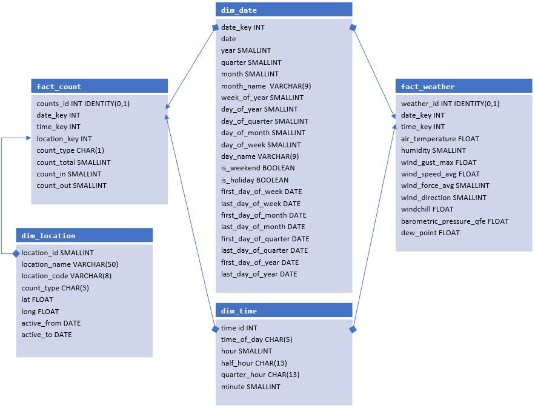
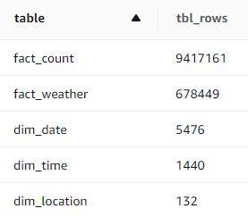

# Analytics DB With 'Open Data' from Zurich, Switzerland

Capstone Project Data Engineer Nanodegree, June 2020

## Introduction

### Project Background

When starting this project, I wanted to work with the largest publicly available _local_ datasets I could get. I turned out that there is not so much of impressive size around here, but at least [Open Data Zurich](https://data.stadt-zuerich.ch/) is providing some multi-million-row sets (although they are far away from being "big data").

In terms of content, my goal was to combine different data sets in a distributed AWS Redshift database in such a way that they would be easy to extract for analytical purposes.

### Project Overview

In the end I worked with two data sets:

1. **Traffic count for non-motorized traffic (pedestrians and bicycles)**, which has been collected every quarter of an hour since the end of 2009 at a total of over 130 stations.
2. **Weather measurements (temperature, humidity, wind, precipitation etc.)** which have been collected every ten minutes since 2007 (one station only).

Use Case:

Data scientists investigating how the traffic at the various locations has developed over the years and what influence the weather may have on it.

Requirements:

To provide the data in an way that is easy to the handle but at the same time allows flexibility, scalability and the possibility to add more dimensions and facts in the future (e.g. counts for motorized traffic, data on air pollution).

Solution:

To reate a DB containing a fact table each for the traffic counts and the weather data. Linking them with a dim_date and a dim_time table to make queries for comparative analysis easy. (And thereby taking into account that the measurements are not in sync, hence the special design of the dim_time table.)

Project Flow:


## Data

### Data Model

The data model contains five tables:



`fact_count` is by far the largest table, with more than 9 Mio rows at the time of completing the project:



### Data Sources

- traffic counts: CSV file per year, these are downloaded programatically.
- weather data:
  - Single CSV file for all data up to 2019, this is downloaded programatically.
  - Data for actual year is requested from an [API](https://tecdottir.herokuapp.com/docs/).
- traffic locations: JSON file, has to be downloaded manually (request by email).
- date an time dimensions: Because Redshift does not support all necessary data types, these tables have been developed locally in postgreSQL and were then copied into Redshift (see Acknowledgements section at the bottom of this file.)

### Data Quality Checks

Quality checks were incorporated into the ETL process. The script tests for missing values (and handles them appropriately). It also test for duplicate records and eliminates them prior to loading into the database, as Redshift does not enforce uniqueness and other constraints.

## Other Scenarios

**If the database size was increased by 100X**: Even though the actual data fits neatly into a DB on a local machine, it is stored in a distributed Redshift database running on 2 nodes. This setup is highly scalable, you can work with higher performing nodes or add many new nodes if required. - But to maintain high query performance in such a scenario it might be worth considering moving to a NoSQL database structure such as Cassandra, with each table optimized for a specific query.

**If the database is updated every morning at 7am**: This would make perfect sense because the weather data can be requested in real time and the CSV with the actual traffic counts is updated every day on the Open Data Zurich site. Best thing might be utilizing a pipeline scheduling application such as Airflow, with the uploading tasks implemented using Airflow hooks to AWS S3 buckets and Redshift. Transform tasks could be implemented using python callables with fairly limited modifications to the existing ETL script, especially in the case of the weather data which has an update function implemented already.

**If the database needed to be accessed by 100+ people**: Redshift supports concurrency scaling. In this case Redshift adds clusters as needed to support increases in demand for concurrent querying of the database. But there are a number of technical requirements for concurrency scaling such as node type, sort key type (cannot use interleaved sorting) and query type (e.g. read-only) that must be met. The existing data model and cluster configuration would have to be reviewed to meet these requirements.

## Run

Script to create the the redshift cluster:

``` sh
create_redshift_cluster.py
```

Script to create the database tables or to reset the database:

``` sh
create_tables.py
```

Script to retrieve the data, preprocess it locally and upload it to s3 (ETL, pt. 1):

``` sh
prepare_data.py
```

ETL pipeline to populate the data on s3 into the database tables (ETL, pt. 2):

``` sh
etl.py
```

## Acknowledgements

Ressources which helped me to develop date and time dimensions in postgreSQL:

- [wiki on postgresql.org](https://wiki.postgresql.org/wiki/Date_and_Time_dimensions)
- [blogpost by nicholasduffy.com](https://nicholasduffy.com/posts/postgresql-date-dimension/)
